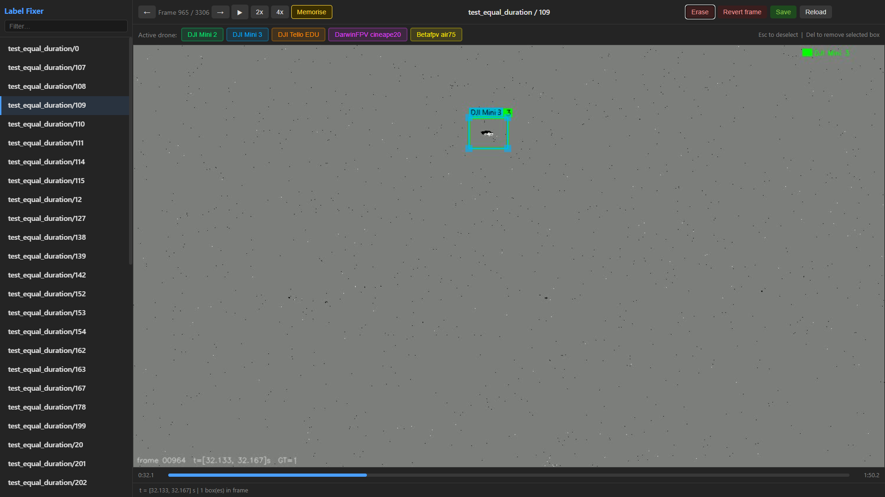

# Label Fixer

A lightweight browser-based tool for reviewing and correcting bounding-box annotations on event camera data, frame by frame.



---

## Motivation

Event camera datasets often contain annotation artefacts: missed frames, misaligned boxes, duplicate labels, or wrong drone IDs introduced during automated labelling pipelines. Fixing these in a raw text file is error-prone and slow.

Label Fixer provides a minimal GUI that renders each 1/30 s event frame as an image (ON events white, OFF events black, background grey), overlays the existing ground-truth bounding boxes, and lets you add, move, resize, delete, or copy boxes with the mouse — then commit the result back to the original `coordinates.txt` format. A non-destructive temp file is kept until you explicitly save, so you can always revert individual frames or reload from disk.

---

## Credits

Built to support annotation correction on the **FRED** (Fast-moving object Recognition using Event-based Detection) dataset.

> Cannici, M., Pinchetti, L., Cacciabaudo, S., & Matteucci, M. (2024).  
> *FRED: A Framework for Drone Detection using Event Cameras.*  
> [https://github.com/miccunifi/FRED](https://github.com/miccunifi/FRED)

---

## Installation

Python 3.10+ is required. Install dependencies with:

```bash
pip install -r requirements.txt
```

Dependencies (`requirements.txt`):
```
flask>=3.0
opencv-python>=4.8
numpy>=1.24
h5py>=3.8
```

### Metavision SDK — ECF codec (FRED / Prophesee Gen4 cameras)

The `events.hdf5` files in the FRED dataset are recorded with a Prophesee Gen4 event camera and compressed using Prophesee's proprietary **ECF (Event Compact Format)** HDF5 codec. Plain `h5py` cannot decompress these files without the codec plugin installed.

To read them you need the **Metavision SDK** from Prophesee, which registers the ECF filter with HDF5 automatically on import:

```bash
pip install metavision-sdk-base
```

> The SDK is available on PyPI for Linux (x86-64) and may require a compatible platform. See the [Prophesee HDF5 format documentation](https://docs.prophesee.ai/stable/data/file_formats/hdf5.html) for details on the file format and platform-specific install instructions.

If you are working with a pre-converted dataset where `events.hdf5` files have already been extracted to a standard uncompressed format, this step is not needed.

---

## Configuration

Before running, open `server.py` and set the two path constants near the top to match your dataset layout:

```python
VIDEOS_DIR = ROOT / 'analysis' / 'videos_test_equal_duration_GT'
SPLIT      = 'test_equal_duration'
```

| Constant | What it points to |
|---|---|
| `VIDEOS_DIR` | Folder containing pre-rendered MP4s named `{split}_{seq}_GT.mp4` |
| `SPLIT` | Name of the dataset split folder under `dataset/` to load sequences from |

`ROOT` is resolved automatically as three directories above `server.py`.  
Expected dataset layout:

```
<ROOT>/
├── dataset/
│   └── <SPLIT>/
│       ├── 34/
│       │   ├── events.hdf5
│       │   └── coordinates.txt
│       └── ...
└── analysis/
    └── <VIDEOS_DIR_NAME>/
        ├── test_equal_duration_34_GT.mp4
        └── ...
```

Videos are optional — sequences without a matching MP4 show a grey canvas but are still fully editable.

To render videos from your event data, use the companion script included in this repo (see [Rendering videos](#rendering-videos) below).

---

## Running the server

```bash
cd tools/label_fixer
python server.py
```

Then open [http://localhost:5000](http://localhost:5000) in your browser.

---

## Using the app

### Sidebar

The left panel lists every sequence in the configured split. Badges indicate:
- **no video** — no MP4 found; annotations still editable
- **unsaved** — unsaved changes exist in the temp file

Click any sequence to open it.

A `?` button in the toolbar (also accessible by pressing `?`) opens an in-app help overlay with the full shortcut reference.

### Keyboard shortcuts

#### Navigation
| Key | Action |
|---|---|
| `D` / `→` | Next frame |
| `A` / `←` | Previous frame |
| `Space` | Play / Pause |
| Scroll wheel | Zoom in / out |

#### Editing
| Key | Action |
|---|---|
| `R` | Erase all boxes in the current frame |
| `E` | Expand all boxes in the current frame by 10% in width and height |
| `M` | Toggle Memorise mode on / off |
| `Del` / `Backspace` | Delete the selected box |
| `Esc` | Deselect active drone / selected box |
| `?` | Open / close help overlay |

### Drawing boxes

1. Click a drone name in the **Active drone** bar to select it (highlighted border).
2. Click and drag on the canvas to draw a bounding box.
3. Click a box to select it; drag its corners to resize or drag its interior to move.
4. Press `Esc` to deselect.
5. Press `Del` or `Backspace` to delete the selected box.

### Memorise mode

Memorise mode lets you quickly stamp a box onto frames where the drone is present but unannotated, using the size of the most recent annotated box as a template.

1. Select the active drone.
2. Press `M` (or click the **Memorise** button) to toggle memorise mode on — the button highlights.
3. Click anywhere on the canvas. A box sized to match the largest box in the **last frame that has any annotation** is centred on your click point.
4. Press `M` again to turn memorise mode off.

This is particularly useful for filling gaps when a drone is continuously visible but annotations are missing for a run of frames.

### Frame operations

| Button | Action |
|---|---|
| **Erase** (`R`) | Remove all boxes from the current frame |
| **Expand All** | Expand annotations in the current frame and all subsequent frames by 10% |
| **Reduce All** | Reduce annotations in the current frame and all subsequent frames by 10% |
| **Revert frame** | Reset the current frame to the original `coordinates.txt` (or `.bak` if it exists) |
| **Revert Seq** | Discard all unsaved changes and restore the entire sequence to original GT |
| **Reload** | Reload all annotations from the temp file on disk |
| **Save** | Commit all changes to `coordinates.txt` (a `.bak` backup is created on first save) |

Changes are pushed to a `coordinates_temp.json` file per sequence as you edit. Nothing is written to `coordinates.txt` until you click **Save**.

---

## Rendering videos

`render_video_with_GT.py` reads `events.hdf5` and `coordinates.txt` for each sequence and writes an MP4 where event frames are overlaid with colour-coded bounding boxes. These MP4s are what the Label Fixer viewer plays.

Videos are named `{split}_{seq}_GT.mp4` and written to a `videos_{split}_GT/` folder next to the script by default, which is exactly where `server.py` expects to find them.

### Render all sequences in a split

```bash
python render_video_with_GT.py --dataset /path/to/dataset --split test_equal_duration
```

### Render a single sequence

```bash
python render_video_with_GT.py --dataset /path/to/dataset --split test_equal_duration --seq 34
```

### Custom output directory

```bash
python render_video_with_GT.py --dataset /path/to/dataset --split test_equal_duration \
    --out-dir /path/to/output/videos
```

> If you use `--out-dir`, update `VIDEOS_DIR` in `server.py` to match.

### All arguments

| Argument | Required | Default | Description |
|---|---|---|---|
| `--dataset` | yes | — | Path to dataset root (contains split sub-folders) |
| `--split` | no | `test_equal_duration` | Split sub-folder name |
| `--seq` | no | all | Single sequence ID to render |
| `--out-dir` | no | `videos_{split}_GT/` next to script | Output directory for MP4s |
| `--fps` | no | `30` | Output video frame rate |
| `--out` | no | — | Explicit output path (single-seq mode only) |

Already-rendered videos are skipped automatically.

---

## File format

Annotations are stored in `coordinates.txt`, one line per annotation:

```
<timestamp_s>: <x1>, <y1>, <x2>, <y2>, <drone_num>, <drone_name>
```

Example:
```
0.033000: 120.0, 45.0, 198.0, 112.0, 1, DJI Mini 2
```

Coordinates are in pixels relative to the sensor resolution. Timestamps correspond to the midpoint sampling within each 1/30 s window.

---

## Citation

This tool is free to use under the MIT licence. If you use it in your research or project, please give credit by citing or acknowledging this repository:

```
Avinash Kumaran. Label Fixer — browser-based annotation correction tool for event camera data.
https://github.com/avinashkumaran/label-fixer
```

If your work also uses the FRED dataset, please cite the original authors:

```bibtex
@misc{fred2024,
  author    = {Cannici, Marco and Pinchetti, Luca and Cacciabaudo, Simone and Matteucci, Matteo},
  title     = {FRED: A Framework for Drone Detection using Event Cameras},
  year      = {2024},
  url       = {https://github.com/miccunifi/FRED}
}
```
